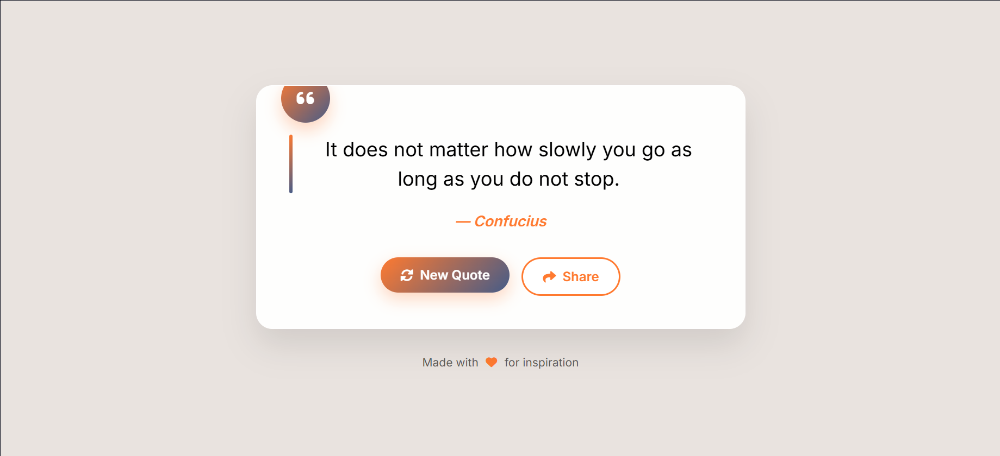

Here's a complete **README.md** for your PHP Random Quote Generator project, including setup, usage, and customization instructions.

---

## 📜 Random Quote Generator

A simple, elegant **PHP-based random quote generator** that displays an inspirational quote with a beautiful UI. Built using PHP, HTML, CSS, and Font Awesome.

## 📸 Screenshot



---

### ✨ Features

* Random quote on each page load
* Refresh for a new quote (no JavaScript needed)
* Share button (copies quote to clipboard)
* Stylish, responsive design
* Custom color palette:

  * Background: `#E9E3DF`
  * Accent: `#FF7A30`
  * Secondary: `#465C88`
  * Text: `#000000`

---

### 🚀 Getting Started

#### 📁 Folder Structure

```
your-project/
├── index.php
└── README.md
```

#### 📦 Requirements

* PHP 7.x or newer
* Web server (e.g., Apache, Nginx, or PHP's built-in server)

---

### 🔧 How to Run Locally

#### ✅ Option 1: PHP Built-in Server (Recommended for Testing)

```bash
php -S localhost:8000
```

Then open your browser and visit:
👉 `http://localhost:8000`

#### ✅ Option 2: XAMPP / WAMP / MAMP

1. Place the project folder inside the `htdocs` (XAMPP) or `www` (WAMP) directory.
2. Start Apache and PHP.
3. Visit:
   👉 `http://localhost/your-project-folder/`

---

### 🛠 Customization

#### 🎨 Change Color Theme

Edit `style.css` and modify these variables:

```css
body {
  background: #E9E3DF;
  color: #000000;
}

.new-quote-btn {
  background: linear-gradient(135deg, #FF7A30, #465C88);
}

.quote-author {
  color: #FF7A30;
}
```

#### ✍️ Add More Quotes

Edit `index.php` and add to the `$quotes` array:

```php
$quotes[] = [
  'text' => 'Your new inspirational quote.',
  'author' => 'Your Name'
];
```

---

### 📱 Responsive Design

Fully responsive and mobile-friendly. Try resizing the browser or opening on your phone.

---

### 📤 Sharing Quotes

The **Share** button copies the quote text and author to your clipboard using JavaScript’s Clipboard API.

---

### 💡 Future Ideas (Optional)

* Add Twitter/X share button
* Store quotes in a JSON or database file
* AJAX refresh without reloading the page
* Animate quote transitions

---

### 🧑‍💻 Author

Created by Ahsan Qamar
Feel free to fork or modify!

---

### 📄 License

This project is open source under the MIT License.
